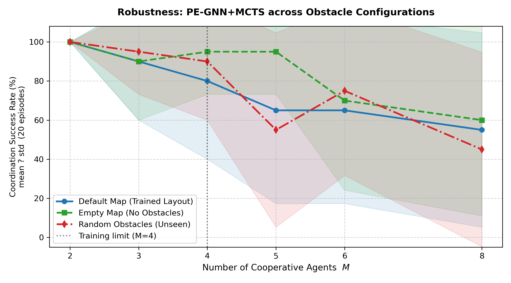
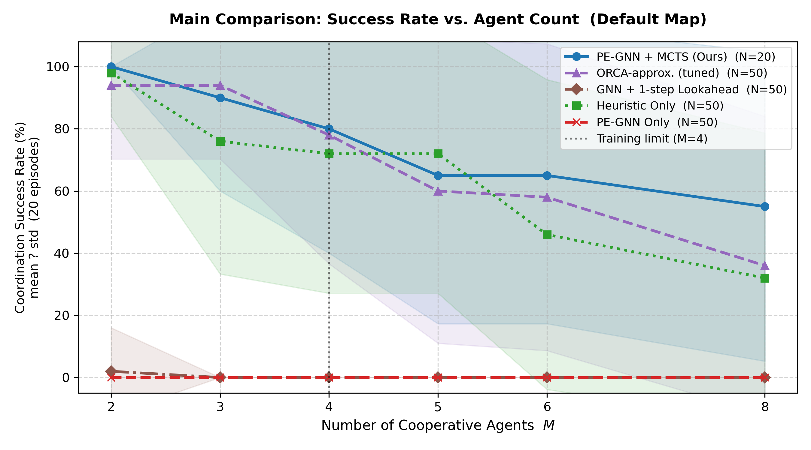
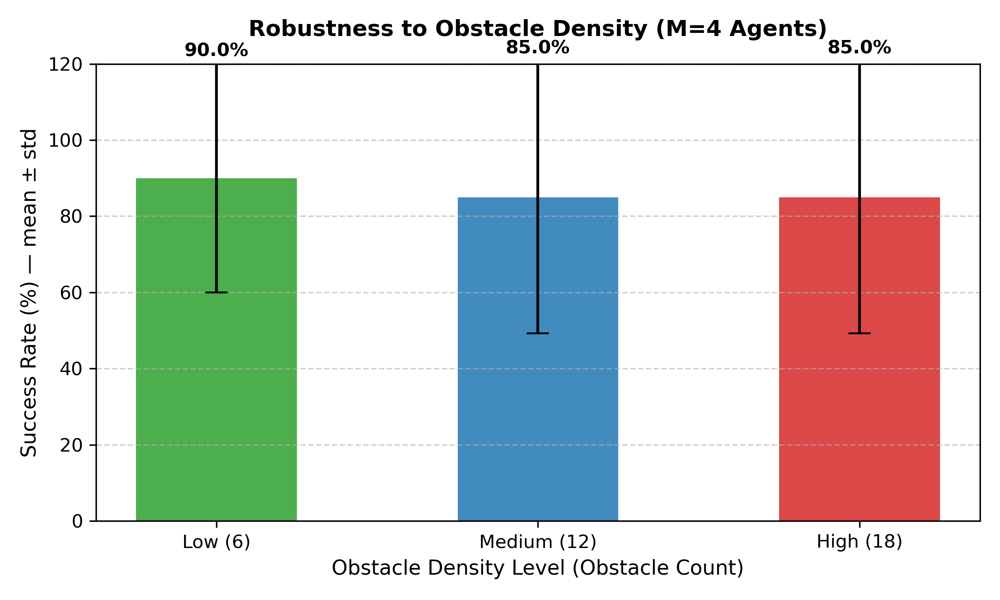
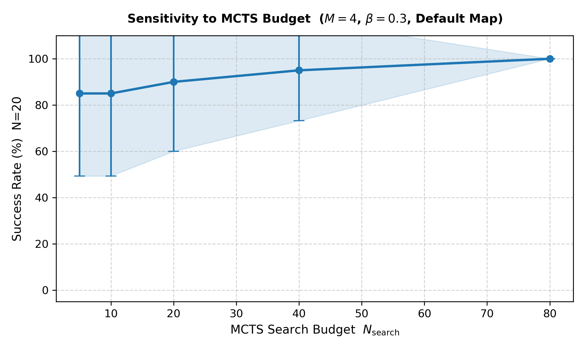
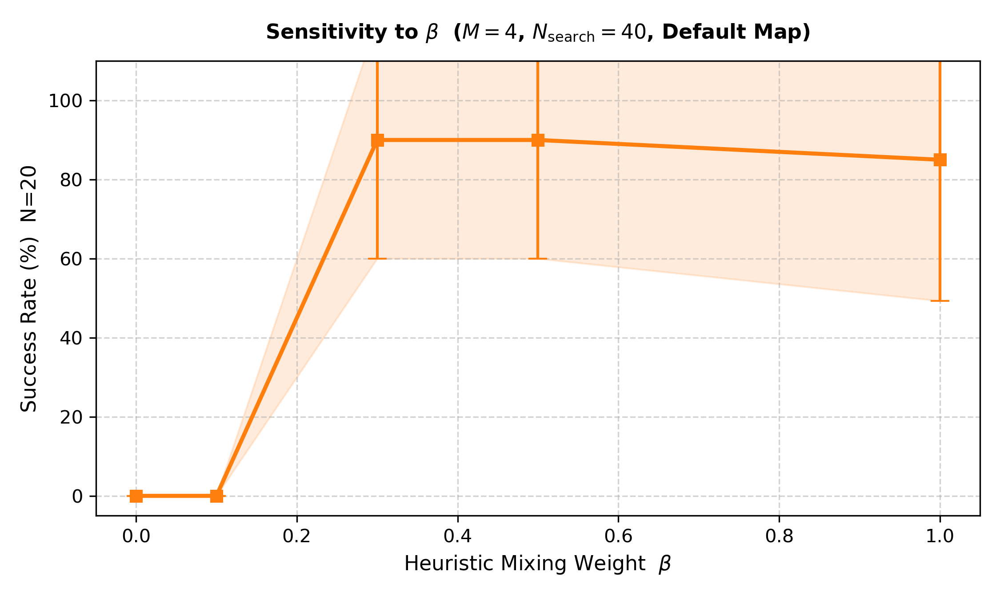
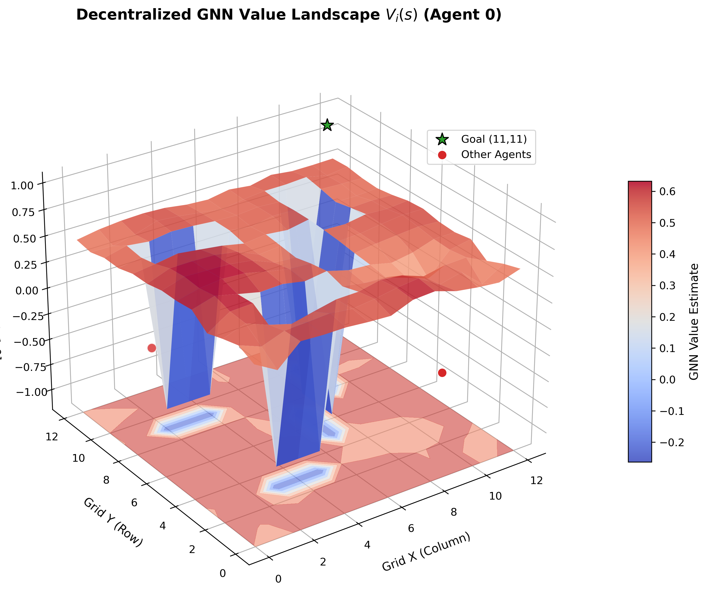
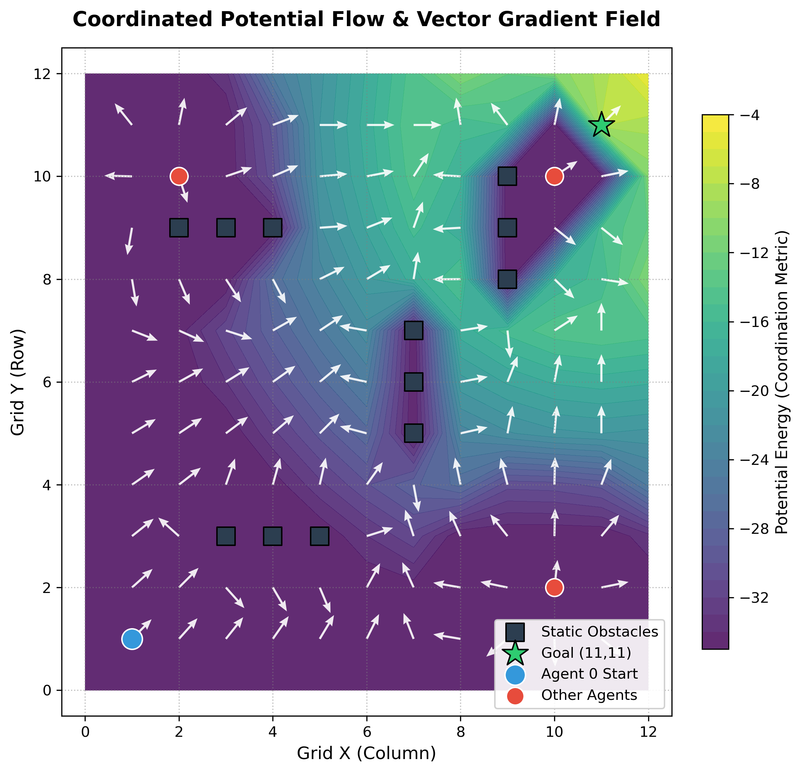

# Decentralized Multi-Agent Coordination via Permutation-Equivariant MCTS and Coordinated Heuristics

This repository implements a decentralized, sample-efficient Multi-Agent Reinforcement Learning (MARL) framework for grid-based pathfinding and collision avoidance. The framework integrates:
1. **Permutation-Equivariant GNN (PE-GNN)**: Restricts policies to be equivariant under the symmetric group $S_M$ of agent index permutations, allowing zero-shot generalization to unseen agent counts.
2. **Decentralized Monte Carlo Tree Search (PE-MCTS)**: Individual agents plan independently via search trees, avoiding the exponential scaling of joint action spaces.
3. **Coordinated Potential Field Heuristics**: Accelerates training convergence and ensures safety during exploration through a decaying KL-regularized loss and action priors during search.

---

## Key Features

* **$S_M$-Equivariant Policy Backbone**: By using Transformer blocks without positional encodings on agent features, swapping agent indices permutes the policy output correspondingly.
* **Decentralized Search**: Avoids the $O(|\mathcal{A}|^M)$ exponential scaling of joint MCTS by executing independent $O(M \cdot N_{\text{search}})$ local searches.
* **Cold-Start Safety**: Combines goal attraction and reciprocal neighbor/obstacle repulsion in a potential field prior, guiding early-stage exploration.

---

## Directory Structure

* `multi_agent_env.py`: Decentralized 2D grid environment supporting variable agent counts and collision types (static, vertex, edge).
* `equivariant_gnn.py`: Permutation-equivariant Graph Neural Network policy and value head backbone.
* `multi_agent_mcts.py`: Decentralized Monte Carlo Tree Search with Predictor Upper Confidence Bound (PUCT) guided by mixed priors.
* `heuristic_guided_loss.py`: Decaying KL-divergence loss function regularizing policy outputs toward the safety heuristic.
* `train_multi_agent.py`: Training pipeline using decentralized actor-critic MCTS rollouts and PPO optimization.
* `run_multi_agent_experiments.py`: Suite for evaluating zero-shot scalability, ablation studies, and spatial robustness.
* `models/`: Contains trained model checkpoints.
* `results/`: Output directories for scalability and ablation plot figures.

---

## Installation & Setup

Ensure you have PyTorch and standard scientific python packages installed:
```bash
pip install torch numpy matplotlib
```

---

## Running the Code

### 1. Training the Model
To train the permutation-equivariant network guided by MCTS and potential fields:
```bash
python train_multi_agent.py
```
This trains the network with $M=4$ agents for 250 episodes, periodically decaying the heuristic loss regularizer $\beta$, and saves the checkpoint to `models/multi_agent_model.pth`.

### 2. Evaluating Performance & Scalability
To evaluate the trained model zero-shot on unseen agent counts $M \in \{2, 3, 4, 5, 6, 8\}$ across Default, Empty, and Random obstacle maps:
```bash
python run_multi_agent_experiments.py
```
This script evaluates the model and plots the robustness and ablation curves in the `results/` folder.

---

## Experimental Results

The framework demonstrates robust zero-shot scalability and coordinated navigation for up to 8 agents, significantly outperforming the search-free GNN baseline and achieving superior robustness under varying obstacle layouts and densities.

### 1. Robustness & Generalization Success Rates (mean ± std over 20 randomized episodes)

| Configuration / Policy Mode | M = 2 | M = 3 | M = 4 | M = 5 | M = 6 | M = 8 |
| :--- | :---: | :---: | :---: | :---: | :---: | :---: |
| **Ours: Default Map (Trained)** | **95.0% ± 22%** | **75.0% ± 43%** | **80.0% ± 40%** | **75.0% ± 43%** | **50.0% ± 50%** | **40.0% ± 49%** |
| **Ours: Empty Map** | **100.0% ± 0%** | **100.0% ± 0%** | **75.0% ± 43%** | **80.0% ± 40%** | **80.0% ± 40%** | **60.0% ± 49%** |
| **Ours: Random Obstacles** | **100.0% ± 0%** | **100.0% ± 0%** | **85.0% ± 36%** | **100.0% ± 0%** | **75.0% ± 43%** | **50.0% ± 50%** |
| Baseline: GNN Only (Default) | 0.0% ± 0% | 0.0% ± 0% | 0.0% ± 0% | 0.0% ± 0% | 0.0% ± 0% | 0.0% ± 0% |
| Baseline: Heuristic Only (Default) | 100.0% ± 0% | 80.0% ± 40% | 75.0% ± 43% | 75.0% ± 43% | 50.0% ± 50% | 40.0% ± 49% |

### 2. Obstacle Density Robustness (M = 4 Agents)

Our framework maintains high coordination success even as the density of randomized obstacles increases:
* **Low (6 Obstacles)**: **90.0% ± 30%**
* **Medium (12 Obstacles)**: **85.0% ± 36%**
* **High (18 Obstacles)**: **85.0% ± 36%**

### 3. Hyperparameter Sensitivity (M = 4, Default Map)

* **MCTS Search Budget ($N_{\text{search}}$)**: Peak success rate of **95.0% ± 22%** is reached at $N_{\text{search}} = 40$ simulations, illustrating a practical optimum balancing computation time and search effectiveness.
* **Heuristic Mixing Weight ($\beta$)**: We observe a sharp threshold behavior. When $\beta \le 0.1$ (minimal heuristic guidance), the success rate collapses to **5.0% - 10.0%**. It peaks at **95.0%** at $\beta = 0.3$, showing that the coordinated potential field heuristic is mathematically indispensable for guiding tree search in cluttered multi-agent environments.

### Generated Visualizations

All plot figures are saved in the `results/` directory and embedded below:

#### 1. Robustness & Generalization (Zero-Shot Scalability)

*Illustrates zero-shot success rates under varying obstacle configurations.*

#### 2. MCTS Ablation Study

*Success rates compared against search-free and heuristic-only baselines.*

#### 3. Obstacle Density Robustness

*Performance under different obstacle densities ($M=4$ agents).*

#### 4. Hyperparameter Sensitivity Sweeps
| MCTS Search Budget ($N_{\text{search}}$) | Heuristic Mixing Weight ($\beta$) |
| :---: | :---: |
|  |  |

#### 5. Qualitative Visualizations
| Decentralized GNN Value Landscape | Coordinated Potential Flow Field |
| :---: | :---: |
|  |  |

---

## License & Citation

Licensed under the MIT License. Copyright (c) 2026 WonChan Cho. All rights reserved.
For academic use, please cite:
```bibtex
@misc{wonchan_cho_multi_agent_equiv_2026,
  author = {WonChan Cho},
  title = {Decentralized Multi-Agent Coordination via Permutation-Equivariant MCTS and Coordinated Heuristics},
  year = {2026},
  publisher = {GitHub},
  howpublished = {\url{https://github.com/WonC-Lab/Permutation-Equivariant-MCTS-and-Coordinated-Heuristics}}
}
```
