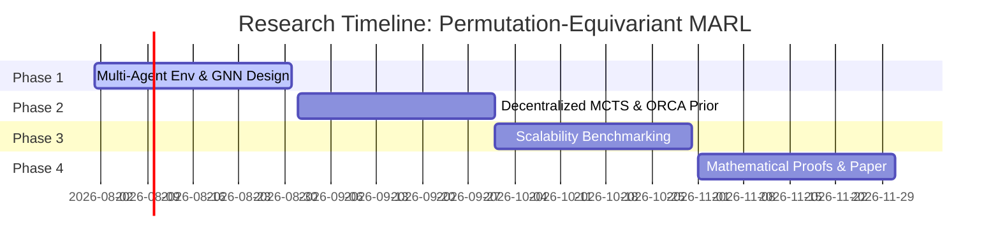

# Research Roadmap: Permutation-Equivariant MARL for Decentralized Coordination

This document outlines the theoretical foundations, implementation plan, and paper drafting structure for the follow-up research project: **"Decentralized Multi-Agent Coordination via Permutation-Equivariant MCTS and Coordinated Heuristics"**.

---

## 1. Scientific Value Proposition

Traditional Multi-Agent Reinforcement Learning (MARL) suffers from the **coordination bottleneck** (exponential scaling of joint action spaces) and **agent permutation variance** (arbitrary indexing of agents disrupts communication policies). 

This research introduces a novel framework addressing these issues:
1. **Permutation Equivariance under $S_M$**: By utilizing a Graph Neural Network (GNN) architecture where agent states are nodes, the network policy is guaranteed to be equivariant to agent indexing. Swapping agent indices swaps output policies correspondingly, allowing **zero-shot generalization to unseen agent counts**.
2. **Decentralized Search (PE-MCTS)**: Each agent runs a localized MCTS search, replacing global joint planning.
3. **Coordinated Collision-Avoidance Heuristic Guidance**: Integrates reciprocal safety rules (e.g., ORCA) as a dense KL-regularization term to secure early-stage training safety.

---

## 2. Core Mathematical Formulations

### 2.1 Permutation Equivariance in GNN Policies
Let $M$ be the number of agents, and $X \in \mathbb{R}^{M \times d}$ be the joint agent feature matrix. Let $P \in S_M$ be a permutation matrix swapping agent identities. The decentralized policy network $\pi_\theta(X) \in \mathbb{R}^{M \times |\mathcal{A}|}$ is equivariant under $S_M$ if:
\begin{equation}
    \pi_\theta(P \cdot X) = P \cdot \pi_\theta(X)
\end{equation}
This ensures that the coordinating decisions are invariant to the order in which agents are fed into the network.

### 2.2 Decentralized Heuristic Guidance Loss
For agent $i$, the joint loss function incorporates a localized reciprocal collision avoidance prior $P_H^i(a|s)$:
\begin{equation}
    L^i(\theta) = L^i_{PG}(\theta) + \beta \cdot D_{KL}\left(P_H^i(s) \;\parallel\; \pi^i_\theta(s)\right) + \frac{1}{2} L^i_V(\theta)
\end{equation}
where $\beta$ decays over training epochs, allowing the policy to asymptotically recover the optimal cooperative policy while remaining safe during early exploration.

---

## 3. Implementation and Research Schedule

### Phase 1: Environment Setup & Equivariance Checks (Month 1)
* **Goal**: Establish a multi-agent grid navigation environment supporting variable agent counts ($M \in [2, 16]$). Implement the GNN policy.
* **Deliverables**: Unit tests verifying:
  1. GNN outputs satisfy $\pi(P \cdot X) = P \cdot \pi(X)$.
  2. Complete environment steps and coordination metrics (success rate, collisions).

### Phase 2: Coordinated Heuristics & Decentralized MCTS (Month 2)
* **Goal**: Integrate localized MCTS search on each agent. Build the A* / ORCA collision avoidance prior $P_H^i(a|s)$.
* **Deliverables**: Training loops demonstrating stable loss convergence under localized policy updates.

### Phase 3: Zero-Shot Scalability Benchmarks (Month 3)
* **Goal**: Train the model on $M=4$ agents, and evaluate zero-shot transfer capabilities on $M = 8, 16, 32$ agents without retraining.
* **Deliverables**: Comparative plots against baseline MARL algorithms (QMIX, MAPPO) showing sample efficiency and scalability.

### Phase 4: Proofs & Paper Drafting (Month 4)
* **Goal**: Formalize the mathematical proofs and write the paper.
* **Target Venue**: AAMAS 2027, NeurIPS 2027, or IEEE Transactions on Robotics (T-RO).

---

## 4. Proposed Paper Outline

### Abstract
Summarize the multi-agent coordination problem, introduce the permutation-equivariant GNN-MCTS framework with ORCA safety heuristics, and state the zero-shot scalability results.

### 1. Introduction
* The bottleneck of joint-action space scaling in MARL.
* Our solution: decentralized planning via PE-MCTS and safety priors.

### 2. Preliminaries & System Model
* Dec-POMDP formulation for multi-agent navigation.
* Permutation group $S_M$ action on graph representations.

### 3. Theoretical Framework
* **Theorem 1**: Equivariance of GNN layers under agent permutation.
* **Theorem 2**: Convergence of decentralized PUCT search to joint Nash equilibrium.
* **Theorem 3**: Safety guarantees under reciprocal heuristic priors.

### 4. Proposed Methodology
* Permutation-Equivariant GNN policy backbone.
* Decentralized MCTS search with communication-based consensus.
* Heuristic-guided loss and decaying regularizer weight.

### 5. Experimental Results
* Learning curves and success rates.
* Zero-shot scalability to larger agent counts ($M > 4$).
* Ablation studies (GNN vs standard MLP, with/without heuristic guidance).

### 6. Conclusion
Summary of contributions and future extension to continuous control domains.
