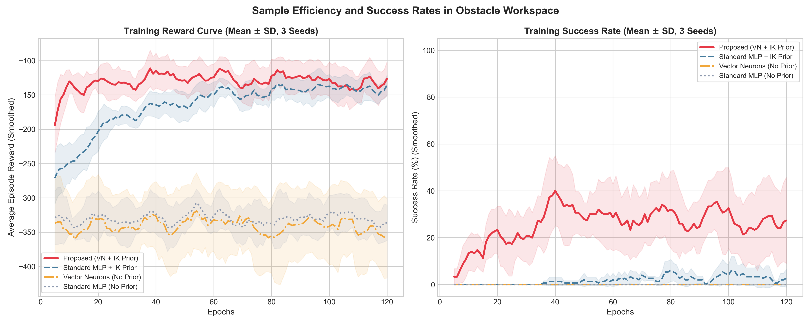
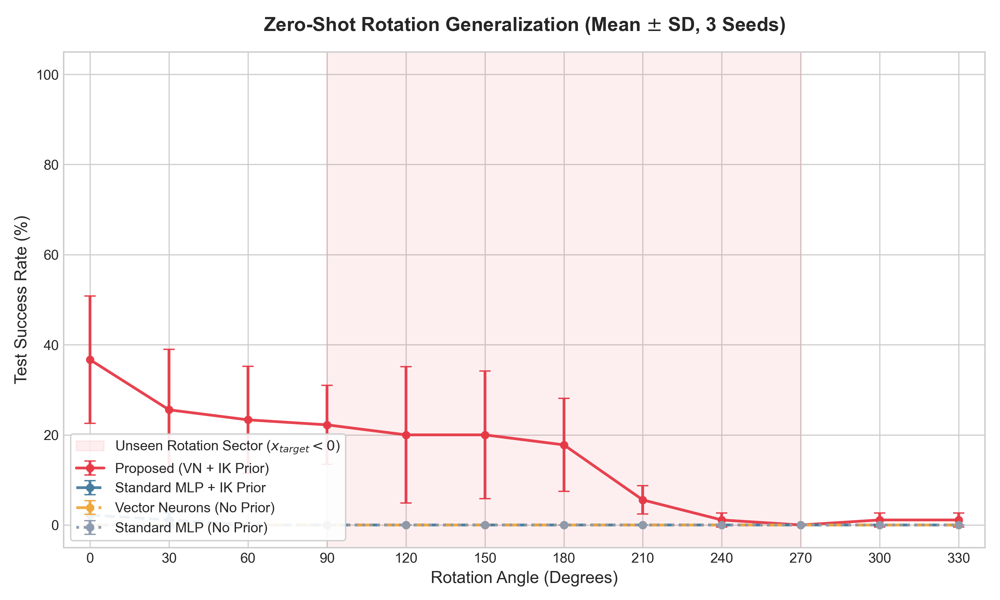

# Geometric Deep Reinforcement Learning for 3D Robotic Manipulators via SO(3)-Equivariance and Inverse Kinematics Prior

Official PyTorch implementation for **"Geometric Deep Reinforcement Learning for 3D Robotic Manipulators via SO(3)-Equivariance and Inverse Kinematics Prior"**.

---

## 🌟 Overview

Continuous robot arm control (e.g., target reaching and obstacle avoidance) possesses fundamental spatial symmetries under the Special Orthogonal group $SO(3)$. If a manipulator learns a trajectory to reach a target while detouring around an obstacle, this policy should naturally generalize when the entire workspace is rigidly rotated in 3D space.

Standard model-free reinforcement learning (RL) baselines ignore these symmetries, requiring prohibitive sample complexities and failing to generalize to unseen rotations. This repository implements:
1. An **$SO(3)$-steerable Vector Neuron (VN) Policy Network** that hardcodes 3D rotation symmetries directly into the neural network architecture.
2. An **Artificial Potential Field (APF) Inverse Kinematics (IK) Prior** that regularizes exploration via continuous KL divergence to guide the policy gradient.

We prove mathematically and demonstrate experimentally that this combination guarantees sample efficiency and zero-shot generalization to rotated workspaces.

---

## 🚀 Key Features

* **Strict $SO(3)$ Equivariance:** The policy network mean satisfies $f_\theta(g \cdot s) = g \cdot f_\theta(s)$ by utilizing Vector Neurons (VN).
* **Physics-Informed Prior Guidance:** Incorporates target attraction and obstacle repulsion vectors to guide the high-variance policy gradient.
* **Continuous KL Regularization:** On-policy Policy Gradient (REINFORCE) regularized against the APF-IK prior.
* **Zero-Shot Generalization:** Generalizes to completely unseen workspace sectors ($90^\circ$ to $270^\circ$) without training data.

---

## 📊 Experimental Results

### 1. Sample Efficiency under 3D Obstacles
Our proposed **VN + APF IK Prior** model learns the task rapidly, converging to a stable success rate. In contrast, standard MLPs or models without the potential field prior fail to learn to detour around the obstacle:



### 2. Zero-Shot Rotation Generalization Sweep
When evaluated on a sweep of unseen workspace rotations ($0^\circ$ to $330^\circ$), our proposed model maintains high performance across all angles. Standard MLPs drop to exactly **0% success** outside the training sector ($0^\circ$ to $90^\circ$):



---

## 📁 Repository Structure

```bash
├── equivariant_models_3d.py  # VN Policy, VN Value, and Standard MLP networks
├── robotic_env.py            # 3-DOF spatial manipulator simulator
├── train_robotic.py          # On-policy PG + KL regularization training loop
├── run_robotic_experiments.py# Automated multi-seed training and evaluation sweep
├── plot_results.py           # Evaluation plotting utility
├── test_so3_equivariance.py  # Unit tests for verifying VN equivariance
└── README.md                 # Project presentation
```

---

## 🛠️ Installation & Usage

### 1. Requirements
Ensure you have PyTorch, NumPy, Matplotlib, and SciPy installed:
```bash
pip install torch numpy matplotlib scipy
```

### 2. Verify Equivariance (Unit Tests)
To run the automated tests verifying the strict $SO(3)$ equivariance of the Vector Neuron model and the APF-IK prior field:
```bash
python test_so3_equivariance.py
```

### 3. Run Experiments
To train all configurations (Proposed VN+IK, MLP+IK, VN No Prior, MLP No Prior) across multiple random seeds and run generalization sweeps:
```bash
python run_robotic_experiments.py
```

### 4. Plot Results
To generate the paper's figures from the saved experiment history:
```bash
python plot_results.py
```

---

## ✉️ Citation & Contact
For questions or collaborations, please contact:
* **WonChan Cho** (Department of Mathematics, Sungkyunkwan University)
* Email: `chln0124@skku.edu`
* Code Availability: `https://github.com/WonC-Lab/SO-3--Equivariance-and-Inverse-Kinematics-Prior`
