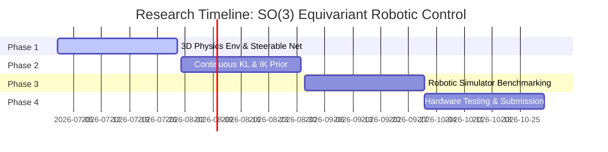

# Roadmap: Geometric Deep Reinforcement Learning for 3D Robotic Manipulators via SO(3)-Equivariance and Inverse Kinematics Prior

This document details the research roadmap for scaling Group Equivariant Policy Networks and Inverse Kinematics priors to 3D continuous robot manipulator workspaces under the Special Orthogonal group $SO(3)$.

---

## 1. Research Overview
Continuous robot arm control (e.g., reaching, pick-and-place) exhibits spatial symmetries under 3D rotations. If a robot knows how to reach a target coordinate, it should know how to reach the same target rotated by any angle in 3D space. 

This research proposes using **$SO(3)$-Steerable Policy Networks** (e.g., using Vector Neurons or Spherical Harmonics) to learn 3D reaching actions. Because continuous 3D workspaces make tree search (like MCTS) computationally prohibitive, we regularize the policy gradient using a **deterministic Inverse Kinematics (IK) / Potential Field prior** $P_H(a|s)$ via KL divergence, accelerating convergence in continuous spaces.

---

## 2. Core Mathematical Formulations

### 2.1 SO(3) Equivariance in 3D Workspaces
Let $g \in SO(3)$ be a 3D rotation matrix. The state coordinates $s = (x_{target}, x_{end\_effector}, x_{obstacles})$ transform linearly under $g$. The continuous policy $\pi_\theta(a|s)$ predicting joint angular velocities must satisfy:
$$\pi_\theta(g \cdot a \mid g \cdot s) = g \cdot \pi_\theta(a \mid s)$$
where the action vector $a \in \mathbb{R}^d$ is rotated in correspondence with the input coordinates.

### 2.2 Continuous KL Regularization
We define the continuous KL divergence to align the steerable network policy $\pi_\theta(\cdot|s)$ with a vector-field IK baseline $P_H(\cdot|s)$:
$$D_{KL}(P_H(s) \parallel \pi_\theta(s)) = \int_{\mathcal{A}} P_H(a \mid s) \log \left( \frac{P_H(a \mid s)}{\pi_\theta(a \mid s)} \right) da$$

---

## 3. Step-by-Step Research Roadmap

### Phase 1: 3D Environment & Steerable Network Design (Weeks 1-4)
* **Goal:** Set up a 3D robotic simulator (e.g., PyBullet, MuJoCo, Isaac Gym) for a multi-joint manipulator. Implement a steerable neural network backbone using Vector Neurons.
* **Deliverables:** Unit tests verifying $SO(3)$ policy equivariance: applying a 3D rotation matrix to target locations yields rotated output joint velocity predictions.

### Phase 2: Inverse Kinematics prior & Continuous KL (Weeks 5-8)
* **Goal:** Formulate the IK-based guidance policy $P_H(a|s)$ (which computes joint velocities towards targets while avoiding joint limits). Formulate the continuous Gaussian KL loss term.
* **Deliverables:** Training pipelines demonstrating policy updates using the combined IK-Advantage gradient.

### Phase 3: Simulator Benchmarking & Convergence Tests (Weeks 9-12)
* **Goal:** Compare sample efficiency and final success rates against standard MLP architectures, SAC (Soft Actor-Critic), and DDPG baselines.
* **Deliverables:** Training plots showing that $SO(3)$ equivariance reduces the required sample count by several orders of magnitude.

### Phase 4: Hardware Demonstration & Thesis Formulation (Weeks 13-16)
* **Goal:** Apply the trained policy model directly to a physical robot manipulator (sim-to-real transfer). Draft the research paper.
* **Target Venue:** International Journal of Robotics Research (IJRR), IEEE Transactions on Robotics (T-RO), or IROS.

---

## 4. Key Challenges & Mitigation
* **Challenge:** Continuous action space KL divergence cannot always be computed analytically if $\pi_\theta(a|s)$ is a complex distribution.
* **Mitigation:** Model $\pi_\theta(a|s)$ and $P_H(a|s)$ as multivariate Gaussians with diagonal covariance matrices, allowing the KL divergence to be computed in closed-form:
  $$D_{KL}(P_H \parallel \pi) = \frac{1}{2} \left[ \text{tr}(\Sigma_\pi^{-1} \Sigma_H) + (\mu_\pi - \mu_H)^T \Sigma_\pi^{-1} (\mu_\pi - \mu_H) - k + \ln \left( \frac{\det \Sigma_\pi}{\det \Sigma_H} \right) \right]$$
