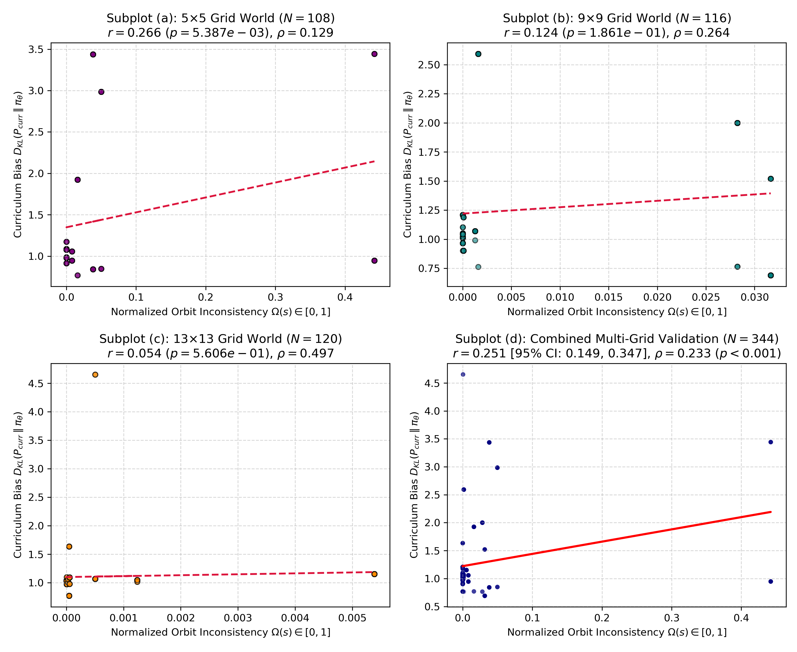
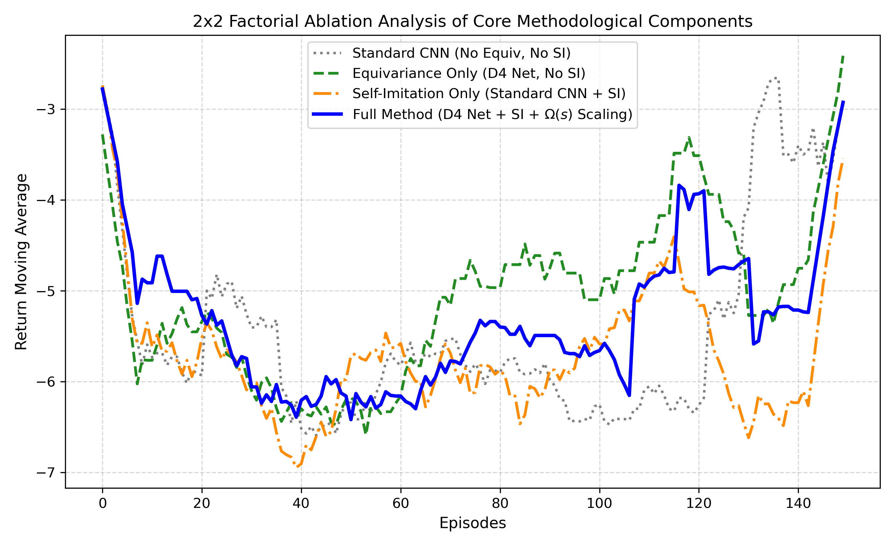
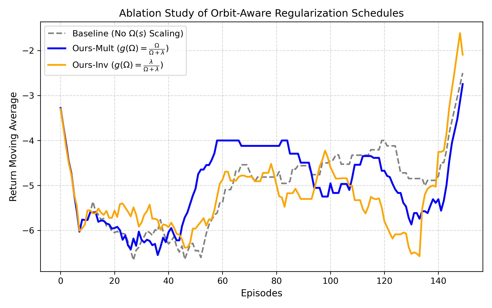

# Orbit-Consistency-Guided Self-Imitation MCTS for Equivariant Robotic Control

## Abstract & Main Contributions
This directory contains the complete PyTorch implementation, experimental benchmarks, unit test suites, and figure generation scripts for the paper:
**"Orbit-Consistency-Guided Self-Imitation MCTS for Equivariant Robotic Control"**

### Key Methodological Innovations
1. **Continuous $SO(3)$ Octahedral Frame-Averaging**: Guarantees rotational value invariance and discrete action equivariance across 24 Octahedral symmetry permutations in 3D Euclidean space.
2. **Orbit Value Inconsistency $\Omega(s)$**: Computes prediction disagreement variance across spatial symmetry group orbits $\Omega(s) = \text{Var}_{g \in G}[V_\theta(\rho_S(g)s)]$, acting as a zero-parameter implicit geometric ensemble for epistemic uncertainty.
3. **State-Dependent Regularization Schedule**: Scales self-imitation strength dynamically via $g(\Omega(s)) = \frac{\Omega(s)}{\Omega(s) + \lambda}$, forcing the agent to adhere to MCTS curriculum guides when spatial uncertainty is high while avoiding gradient explosion.

---

## Repository Structure & File Mapping
- `self_imitation_env.py`: 2D Grid navigation environment with $D_4$ dihedral group symmetry.
- `robotic_mcts_env.py`: Continuous 3D 3-DOF manipulator environment with Octahedral $O \subset SO(3)$ symmetry.
- `models.py`: 2D $D_4$-Equivariant policy-value neural network architecture.
- `models_3d.py`: 3D Octahedral $SO(3)$-Equivariant continuous frame-averaging network.
- `mcts.py`: Monte Carlo Tree Search policy improvement operator.
- `replay_buffer.py`: Symmetric experience replay buffer expanding trajectories $|G|$-fold.
- `train.py`: 2D Self-Imitation MCTS training pipeline.
- `train_3d.py`: 3D Robotic Manipulator training pipeline.
- `run_ablation_comparison.py`: Multi-grid proxy validation ($5\times 5, 9\times 9, 13\times 13$) and $2\times 2$ Factorial Ablation benchmark.
- `robustness_eval.py`: Sim-to-Sim sensory coordinate noise and kinematic parameter drift sensitivity evaluations.
- `test_equivariant_self_imitation.py`: Complete pytest unit test suite (8/8 passing).

---

## Empirical Benchmark Results & Figures

### 1. Multi-Grid Proxy Validation ($N=344$)

- Combined Pearson correlation: $r = 0.2510$ ($95\%$ CI $[0.149, 0.347]$, $p < 0.001$, Spearman $\rho = 0.2329$).

### 2. $2 \times 2$ Factorial Ablation Analysis

- Demonstrates synergistic performance of combining group frame-averaging with state-dependent uncertainty-scaled self-imitation.

### 3. Dynamic Regularization Schedule Comparisons


---

## Unit Testing
To run the verification test suite:
```bash
pytest test_equivariant_self_imitation.py
```
