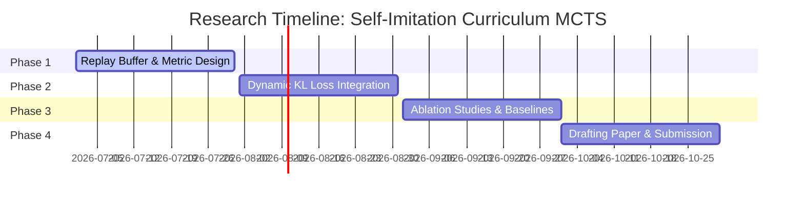

# Roadmap: Self-Imitation Curriculum via Dynamic KL Regularized Monte Carlo Tree Search

This document details the research roadmap for Self-Imitation Curriculum learning using Dynamic KL Divergence Regularization on Monte Carlo Tree Search.

---

## 1. Research Overview
Heuristic-guided reinforcement learning relies on manual heuristics (like $A^*$ or shortest-path search) to accelerate training. However, manual heuristics limit agent performance, bottlenecking the policy as training progresses.

This research proposes replacing the static heuristic $P_H(a|s)$ with a **dynamic curriculum target** derived from the agent's own past best trajectories (Self-Imitation Learning). By dynamically updating the target $P_{curriculum}(a|s)$ using high-reward historical MCTS paths, the agent regularizes its search policy against its own historical bounds, leading to stable, self-improving curriculum trajectories without manual heuristic designs.

---

## 2. Core Mathematical Formulations

### 2.1 Self-Imitation Target Policy
Let $\mathcal{D}_{best}$ be a prioritized replay buffer storing trajectories that exceed the running average return:
$$\mathcal{D}_{best} = \{ \tau \mid R(\tau) > \mathbb{E}[R] \}$$

The dynamic curriculum target $P_{curriculum}(a|s)$ is formulated by computing a softmax over the visit counts $N_{best}(s, a)$ of these high-performing historical MCTS states:
$$P_{curriculum}(a \mid s) \propto N_{best}(s, a)^{1/\tau}$$

### 2.2 Dynamic KL Loss
The policy parameters $\theta$ are updated by regularizing $\pi_\theta(a|s)$ against the dynamic target $P_{curriculum}$, weighting the loss dynamically:
$$L(\theta) = L_{PG}(\theta) + \beta_t \cdot D_{KL}(P_{curriculum}(s) \parallel \pi_\theta(s))$$
where the weight $\beta_t$ is dynamically scaled based on the policy performance gap:
$$\beta_t = \max \left( 0, \bar{V}_{\theta}(s) - \bar{R}_{best} \right)$$

---

## 3. Step-by-Step Research Roadmap

### Phase 1: Replay Buffer & Performance Metric Design (Weeks 1-4)
* **Goal:** Set up a prioritized replay buffer that dynamically stores and cleans high-reward MCTS search trajectories.
* **Deliverables:** A trajectory logging module that updates target distributions $P_{curriculum}(s)$ based on historical MCTS runs.

### Phase 2: Dynamic KL Loss & Training Pipeline (Weeks 5-8)
* **Goal:** Implement the dynamically scaled KL loss. Write the feedback controller that regulates $\beta_t$ based on the performance gap between the current policy and the replay buffer average.
* **Deliverables:** A training script showing policy updates and dynamic adjustment of the self-imitation constraint.

### Phase 3: Benchmarking & Ablation Studies (Weeks 9-12)
* **Goal:** Compare convergence rate, training stability, and final reward against standard Self-Imitation Learning (SIL), PPO, and static Heuristic-guided RL.
* **Deliverables:** Training plots proving that dynamic self-imitation curriculum resolves the bottleneck issue associated with static heuristics.

### Phase 4: Formatting & Submission (Weeks 13-16)
* **Goal:** Compile results, create diagrams explaining the curriculum flow, draft mathematical proofs for policy improvement bounds under KL constraints, and write the paper.
* **Target Venue:** ICLR, NeurIPS, or Machine Learning (Journal).

---

## 4. Key Challenges & Mitigation
* **Challenge:** If the agent experiences policy collapse or starts with poor trajectories, the self-imitation buffer will store sub-optimal paths, leading to confirmation bias (stuck in local minima).
* **Mitigation:** Initialize the buffer with a tiny amount of random exploration or standard exploration noise ($\epsilon$-greedy in MCTS action selection) to ensure the first recorded "best" trajectories are sufficiently diverse.
