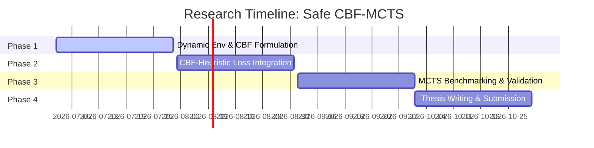

# Roadmap: Safe Exploration in Dynamic Environments via Control-Barrier Heuristic Regularized MCTS

This document details the research roadmap for incorporating Control Barrier Function (CBF) heuristics and Monte Carlo Tree Search to establish safe, sample-efficient reinforcement learning in dynamic workspaces.

---

## 1. Research Overview
Reinforcement learning in dynamic environments (such as moving obstacles or dynamic traffic navigation) faces catastrophic failures and collisions during early training. Although MCTS provides long-term planning, it cannot guarantee step-by-step safety when exploring new states.

This research proposes regularizing the policy output of a dual-head Actor-Critic network during MCTS search using a **Control Barrier Function (CBF)** heuristic. By defining a safe state barrier mathematically, the policy is constrained via KL divergence to select actions that keep the agent within a designated "safe set" $\mathcal{C}$. This ensures that even during exploratory MCTS iterations, the agent never initiates a sequence of actions that results in unavoidable collision.

---

## 2. Core Mathematical Formulations

### 2.1 Control Barrier Functions (CBFs) in Discrete Spaces
Let $h(s)$ be a continuously differentiable scalar function defining a safe set $\mathcal{C}$:
$$\mathcal{C} = \{ s \in \mathcal{S} \mid h(s) \ge 0 \}$$

To guarantee safety, the action policy must satisfy the discrete-time CBF inequality:
$$h(s_{t+1}) - h(s_t) \ge -\alpha(h(s_t))$$
where $\alpha(\cdot)$ is a class $\mathcal{K}$ function. We construct the heuristic policy $P_H(a|s)$ to assign zero probability to any action violating this inequality:
$$P_H(a \mid s) = 0 \quad \text{if} \quad h(\mathcal{P}(s, a)) - h(s) < -\alpha(h(s))$$

### 2.2 Heuristic PUCT Regularization
The KL regularization term forces the policy network $\pi_\theta(a|s)$ to conform to $P_H(a|s)$, which mathematically acts as a dynamic safety barrier:
$$D_{KL}(P_H(s) \parallel \pi_\theta(s)) = \sum_{a \in \mathcal{A}} P_H(a|s) \log \left( \frac{P_H(a|s)}{\pi_\theta(a|s)} \right)$$

---

## 3. Step-by-Step Research Roadmap

### Phase 1: Dynamic Environment Setup & CBF Definition (Weeks 1-4)
* **Goal:** Set up a 2D environment containing moving obstacles with deterministic/stochastic velocities. Formulate the mathematical barrier candidate $h(s)$ (e.g., minimum distance to dynamic obstacle centers).
* **Deliverables:** A simulator that computes $h(s)$ at each timestep and returns the set of mathematically safe actions.

### Phase 2: CBF-Heuristic Loss Integration (Weeks 5-8)
* **Goal:** Implement the KL-divergence regularization using the CBF-based safety distribution $P_H(s)$ and train the policy network.
* **Deliverables:** Verification that the policy network $\pi_\theta(a|s)$ assigns near-zero probabilities to dangerous actions, even in untrained early stages.

### Phase 3: MCTS Integration & Benchmarks (Weeks 9-12)
* **Goal:** Run MCTS search using the CBF-regularized policy as the search prior. Evaluate cumulative collisions, training convergence speed, and final path quality.
* **Deliverables:** Comparative plots demonstrating a near-zero collision rate during the entire training cycle compared to standard AC-MCTS baselines.

### Phase 4: Thesis Writing & Final Evaluation (Weeks 13-16)
* **Goal:** Draft mathematical proofs demonstrating that CBF-guided MCTS guarantees asymptotic safety under Lipschitz continuity of the environment transitions.
* **Target Venue:** IEEE Transactions on Robotics (T-RO) or International Conference on Robotics and Automation (ICRA).

---

## 4. Key Challenges & Mitigation
* **Challenge:** In multi-obstacle environments, finding a valid Control Barrier Function $h(s)$ that satisfies the barrier conditions everywhere is highly difficult.
* **Mitigation:** Use a composite CBF (e.g., taking the minimum of safety functions across all individual obstacles: $h_{comp}(s) = \min_i h_i(s)$) and apply smooth approximations (like Log-Sum-Exp) to maintain differentiability.
