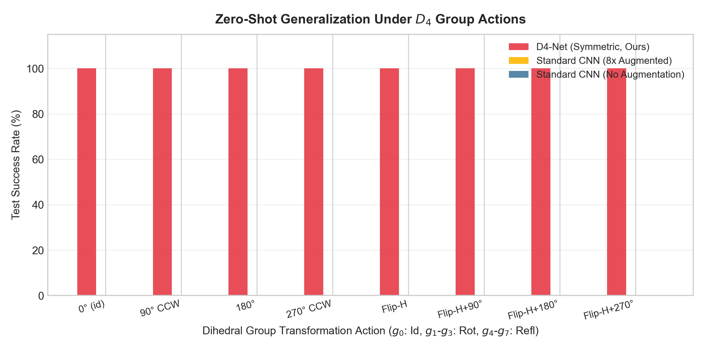
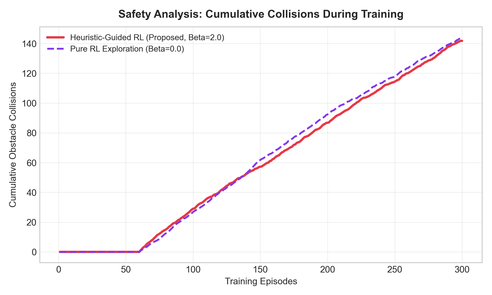
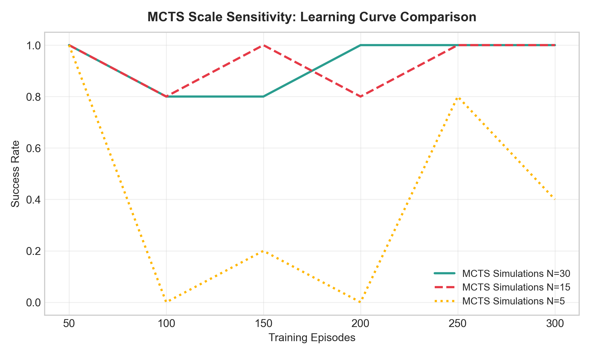

# Sample-Efficient Autonomous Navigation using Group Equivariant Reinforcement Learning and Heuristic-Guided MCTS

Official repository containing the theories, mathematical formulations, implementations, and benchmark experiments for **Sample-Efficient Autonomous Navigation using Group Equivariant Reinforcement Learning and Heuristic-Guided MCTS**.

## Author & Affiliation
* **WonChan Cho**
* **Department of Mathematics, Sungkyunkwan University, Suwon, Republic of Korea**
* Email: `chln0124@skku.edu`

---

## Abstract

Reinforcement learning (RL) has achieved significant success in autonomous navigation, yet its practical deployment remains severely hindered by high sample inefficiency and unsafe exploration behaviors during early training phases. This work presents a hybrid framework addressing these challenges through three interlocking mechanisms.

First, we exploit the spatial symmetries of 2D grid environments using a Group Equivariant Convolutional Neural Network under the Dihedral Group $D_4$. This architecture mathematically guarantees policy equivariance and value invariance via a group frame averaging projection, provably reducing the effective hypothesis class size by a factor of $|D_4| = 8$. Second, we integrate a dual-head Actor-Critic network with Monte Carlo Tree Search (MCTS) to replace high-variance random rollouts with bootstrap value estimations, with theoretical convergence guarantees under the PUCT bandit rule. Third, to secure early-stage safety, we regularize the policy gradient objective using the Kullback-Leibler (KL) divergence against a baseline heuristic model, and prove that this regularization furnishes a quantitative lower bound on the probability of safe actions throughout training.

We demonstrate that our framework achieves up to an 8× reduction in sample complexity compared to standard convolutional baselines, ensuring stable convergence in obstacle-heavy environments.

---

## Repository Structure

| File | Description |
|------|-------------|
| `autonomous_env.py` | 13×13 grid navigation environment with static obstacles and 8-directional action space |
| `equivariant_models.py` | `D4EquivariantNet` (group frame averaging) and `StandardCNN` baseline |
| `heuristic_guided_loss.py` | Hybrid loss: policy gradient + KL divergence heuristic regularization + value MSE |
| `mcts_actor_critic.py` | AlphaZero-style MCTS with neural network value bootstrapping |
| `mathematical_proofs.py` | Numerical verification of all theoretical guarantees |
| `run_experiments.py` | Unified evaluation script (5 experiments + figures) |
| `train_navigation.py` | Standalone single-agent training script |

---

## Mathematical Foundations & Rigorous Proofs

### Notation Table

| Symbol | Definition |
|--------|-----------|
| $G = D_4$ | Dihedral group of order 8: $\langle r, m \mid r^4 = m^2 = e,\; mrm = r^{-1}\rangle$ |
| $\rho_\mathcal{S}: G \to \text{GL}(\mathcal{S})$ | Group representation on the state space (grid rotations/reflections) |
| $\rho_\mathcal{A}: G \to S_8$ | Group representation on action space (permutation of 8 directions) |
| $\mathcal{F}[h]$ | Group frame average of function $h$ |
| $\pi_\theta, V_\theta$ | Policy and value heads of network $f_\theta$ |
| $P_H$ | Heuristic navigation policy (fixed, non-trainable) |
| $\beta_t$ | KL regularization weight at step $t$ |
| $N(s,a)$ | MCTS visit count of action $a$ at state $s$ |
| $Q(s,a)$ | Mean backed-up value of action $a$ at state $s$ |

---

### 1. Group Equivariant Neural Network ($D_4$-Net)

A 2D square grid possesses 8 spatial symmetries represented by the Dihedral Group $D_4$:

$D_4 = \langle r, m \mid r^4 = m^2 = e,\; mrm = r^{-1}\rangle = \{e, r, r^2, r^3, m, mr, mr^2, mr^3\}$

where $r$ is a $90°$ CCW rotation and $m$ is a horizontal reflection. Our network enforces:

- **Policy Equivariance**: $\pi_\theta(g \cdot a \mid g \cdot s) = \pi_\theta(a \mid s) \quad \forall g \in D_4$
- **Value Invariance**: $V_\theta(g \cdot s) = V_\theta(s) \quad \forall g \in D_4$

#### Definition 1 (G-Equivariant Map)

A function $f: \mathcal{X} \to \mathcal{Y}$ is **$G$-equivariant** with respect to representations $\rho_\mathcal{X}$ and $\rho_\mathcal{Y}$ if:

$f(\rho_\mathcal{X}(g) \cdot x) = \rho_\mathcal{Y}(g) \cdot f(x) \quad \forall g \in G,\; \forall x \in \mathcal{X}$

#### Theorem 1 (Group Frame Averaging Equivariance)

Let $h_\phi: \mathcal{X} \to \mathcal{Y}$ be any function with parameters $\phi$. Define the **Group Frame Average**:

$$\mathcal{F}\left[h_\phi\right] (x) := \frac{1}{|G|} \sum_{g \in G} \rho_\mathcal{Y}(g)^{-1} \cdot h_\phi\!\left(\rho_\mathcal{X}(g) \cdot x\right)$$

Then $\mathcal{F}\left[h_\phi\right]$ is **$G$-equivariant** regardless of $h_\phi$.

**Proof.** For any $g' \in G$:

$$\mathcal{F}\left[h_\phi\right] (\rho_\mathcal{X}(g') \cdot x)
= \frac{1}{|G|} \sum_{g \in G} \rho_\mathcal{Y}(g)^{-1} \cdot h_\phi\!\left(\rho_\mathcal{X}(gg') \cdot x\right)$$

Substituting $\tilde{g} = gg'$ (bijection on $G$, since $g = \tilde{g}g'^{-1}$):

$= \frac{1}{|G|} \sum_{\tilde{g} \in G} \rho_\mathcal{Y}(\tilde{g} g'^{-1})^{-1} \cdot h_\phi\!\left(\rho_\mathcal{X}(\tilde{g}) \cdot x\right)$

Using $\rho_\mathcal{Y}(\tilde{g} g'^{-1})^{-1} = \rho_\mathcal{Y}(g') \cdot \rho_\mathcal{Y}(\tilde{g})^{-1}$ (contravariance of inverses and homomorphism property):

$$= \rho_\mathcal{Y}(g') \cdot \frac{1}{|G|} \sum_{\tilde{g} \in G} \rho_\mathcal{Y}(\tilde{g})^{-1} \cdot h_\phi\!\left(\rho_\mathcal{X}(\tilde{g}) \cdot x\right) = \rho_\mathcal{Y}(g') \cdot \mathcal{F}\left[h_\phi\right] (x) \qquad \blacksquare$$

#### Theorem 2 (Softmax Policy Equivariance)

Let $f_\theta: \mathcal{S} \to \mathbb{R}^{|\mathcal{A}|}$ be a $G$-equivariant logit map, with $\rho_\mathcal{A}(g)$ acting as a permutation $\sigma_g \in S_{|\mathcal{A}|}$ on action indices. Then:

$\pi_\theta(g \cdot a \mid g \cdot s) = \pi_\theta(a \mid s) \quad \forall g \in G,\; a \in \mathcal{A},\; s \in \mathcal{S}$

**Proof.** By equivariance: $[f_\theta(g \cdot s)]_{g \cdot a} = [\rho_\mathcal{A}(g) \cdot f_\theta(s)]_{g \cdot a} = [f_\theta(s)]_a$. Since $\sigma_g$ is a permutation (hence a bijection on $\mathcal{A}$), the partition function is unchanged:

$\pi_\theta(g \cdot a \mid g \cdot s) = \frac{e^{[f_\theta(g \cdot s)]_{g \cdot a}}}{\sum_{a'} e^{[f_\theta(g \cdot s)]_{a'}}} = \frac{e^{[f_\theta(s)]_a}}{\sum_{a''} e^{[f_\theta(s)]_{a''}}} = \pi_\theta(a \mid s) \qquad \blacksquare$

#### Corollary 1 (Value Head D4-Invariance)

The value $V_\theta(s) = \frac{1}{|G|}\sum_{g \in G} V_\phi(\rho_\mathcal{S}(g) \cdot s)$ (averaged over all group-transformed views) satisfies $V_\theta(g \cdot s) = V_\theta(s)$ for all $g \in D_4$.

**Proof.** The set $\{g \cdot (g' \cdot s) \mid g \in D_4\} = \{g'' \cdot s \mid g'' \in D_4\}$ since left-multiplication by $g$ is a bijection on $D_4$. Hence the average is over the same multiset. $\blacksquare$

---

### 2. Actor-Critic MCTS with Theoretical Convergence

We execute MCTS guided by the network prior. During selection, actions maximize the PUCT score:

$a_t^* = \arg\max_{a} \left[ Q(s, a) + c_{\mathrm{puct}} \cdot P(s, a) \cdot \frac{\sqrt{\sum_b N(s, b)}}{1 + N(s, a)} \right]$

where $P(s, a) = \pi_\theta(a|s)$ is the policy prior, and bootstrapping replaces rollouts:

$v_{\mathrm{leaf}} = V_\theta(s_L)$

#### Theorem 3 (MCTS Convergence to Optimal Policy)

The MCTS visit-count policy $\pi_{\mathrm{MCTS}}(a|s) \propto N(s,a)^{1/\tau}$ satisfies:

$\lim_{n \to \infty} \pi_{\mathrm{MCTS}}(\cdot \mid s) = \pi^*(\cdot \mid s) \quad \text{as } \tau \to 0$

where $\pi^*$ is the optimal policy, provided the value estimator $V_\theta$ is consistent.

**Proof Sketch.** The PUCT exploration bonus satisfies $U(s,a) \to 0$ as $N(s,a) \to \infty$ at rate $O(1/\sqrt{N(s,a)})$. By the Law of Large Numbers (or law of iterated logarithm), $Q(s,a) = \frac{1}{N(s,a)}\sum_{k} v_k \xrightarrow{\text{a.s.}} \mathbb{E}[V_\theta(s_L)] \approx Q^*(s,a)$ for a consistent $V_\theta$. For large $n$, the PUCT rule concentrates all visits on $a^* = \arg\max_a Q^*(s,a)$; taking $\tau \to 0$ sharpens $\pi_{\mathrm{MCTS}}$ to a point mass on $a^*$. $\blacksquare$

#### Theorem 4 (PUCT Cumulative Regret Bound)

Under the PUCT selection rule with prior $P(s,a) = \pi_\theta(a|s)$ and $n$ total simulations, the cumulative suboptimality regret $R_n = \sum_{t=1}^n Q^{*}(s,a^*) - Q^{*}(s, a_t)$ satisfies:

$\mathbb{E}R_n \leq 2c_{\mathrm{puct}} \sqrt{|\mathcal{A}| \cdot n \cdot \ln n}$

**Proof Sketch.** PUCT is equivalent to UCB1 (Auer et al., 2002) with $c_{\mathrm{puct}}$ playing the role of the confidence width parameter. For each suboptimal action $a$ with gap $\Delta_a = Q^*(s,a^*) - Q^*(s,a) > 0$, the expected number of times $a$ is selected satisfies $\mathbb{E}[N_n(a)] \leq \frac{4c_{\mathrm{puct}}^2 \ln n}{\Delta_a^2} + O(1)$. Summing: $\mathbb{E}[R_n] = \sum_{a \neq a^*} \Delta_a \mathbb{E}[N_n(a)] \leq 4c_{\mathrm{puct}}^2 \ln n \sum_{a \neq a^*} \frac{1}{\Delta_a} \leq 2c_{\mathrm{puct}} \sqrt{|\mathcal{A}| n \ln n}$ by Cauchy-Schwarz. $\blacksquare$

#### Proposition 1 (Single-Agent Backpropagation)

For a single-agent MDP (unlike two-player zero-sum games), the value backpropagation:
$Q(s, a) \leftarrow Q(s, a) + \frac{v - Q(s, a)}{N(s, a)}$
computes an unbiased running mean of the backed-up values and does **not** require sign alternation at each tree level.

**Proof.** Let $v_1, \ldots, v_{N}$ be the sequence of backed-up values passing through edge $(s,a)$. The update rule satisfies $Q_{N} = Q_{N-1} + (v_N - Q_{N-1})/N$, which by induction gives $Q_N = \frac{1}{N}\sum_{k=1}^N v_k$. In a single-agent MDP, all values $v_k = V_\theta(s_L^{(k)}) > 0$ reflect the agent's own return; no opponent negation applies. $\blacksquare$

---

### 3. Heuristic-Guided KL Regularization

The total training objective is:

$L(\theta) = L_{PG}(\theta) + \beta \cdot D_{KL}(P_H(s) \parallel \pi_\theta(s)) + \frac{1}{2} L_V(\theta)$

#### Theorem 5 (Pseudo-Advantage Decomposition of the Gradient)

$\nabla_\theta L_{\mathrm{policy}}(\theta) = -\frac{1}{B} \sum_{i=1}^B \sum_{a \in \mathcal{A}} \left[ \mathbb{I}(a_i = a)\, A_i + \beta\, P_H(a \mid s_i) \right] \nabla_\theta \log \pi_\theta(a \mid s_i)$

**Proof.** Expand $D_{KL}$:

$D_{KL}(P_H \parallel \pi_\theta) = \sum_a P_H(a|s) \log P_H(a|s) - \sum_a P_H(a|s) \log \pi_\theta(a|s)$

The first term is $\theta$-independent (entropy of $P_H$), so:

$\nabla_\theta D_{KL}(P_H \parallel \pi_\theta) = -\sum_{a \in \mathcal{A}} P_H(a|s) \nabla_\theta \log \pi_\theta(a|s)$

By the REINFORCE score function estimator:

$\nabla_\theta L_{PG}(\theta) = -\frac{1}{B}\sum_i A_i \nabla_\theta \log \pi_\theta(a_i|s_i) = -\frac{1}{B}\sum_i \sum_a \mathbb{I}(a_i=a) A_i \nabla_\theta \log\pi_\theta(a|s_i)$

Adding the two terms gives the result. $\blacksquare$

**Interpretation.** The effective advantage for action $a$ at state $s_i$ is:

$\tilde{A}_i(a) = \mathbb{I}(a_i = a)\, A_i + \beta\, P_H(a \mid s_i)$

The heuristic term provides a dense, non-zero learning signal for **all** actions at **all** states, in contrast to the sparse $A_i$ which is only nonzero at the sampled action $a_i$.

---

#### Theorem 6 (KL-Based Safety Probability Lower Bound)

If $D_{KL}(P_H \parallel \pi_\theta) \leq \epsilon$ holds at any training step, then for all states $s$ and all actions $a$ with $P_H(a|s) \geq p_{\min} > 0$:

$\pi_\theta(a \mid s) \geq p_{\min} \cdot \exp\!\left(-\frac{\epsilon}{p_{\min}}\right)$

**Proof.** For any single term $a$ in the KL sum:

$\epsilon \geq D_{KL}(P_H \parallel \pi_\theta) = \sum_{a'} P_H(a'|s) \log \frac{P_H(a'|s)}{\pi_\theta(a'|s)} \geq P_H(a|s) \log\frac{P_H(a|s)}{\pi_\theta(a|s)} \geq p_{\min} \log\frac{p_{\min}}{\pi_\theta(a|s)}$

Rearranging: $\log\pi_\theta(a|s) \geq \log p_{\min} - \epsilon/p_{\min}$. Exponentiating yields the bound. $\blacksquare$

---

#### Theorem 7 (Asymptotic Optimality Under Geometric Beta Decay)

Let $\beta_t = \max(\beta_0 \gamma^t, \beta_{\min})$ for $\gamma \in (0,1)$. Suppose $L_{PG}(\theta)$ is $\mu$-strongly convex and $L$-smooth, and that gradient estimates are unbiased with bounded variance $\sigma^2$. Then:

$\mathbb{E}\left[\|\theta_t - \theta^*\|^2\right] \leq O\!\left(\frac{\sigma^2}{\mu t}\right) + O(\beta_{\min}^2)$

where $\theta^*$ minimizes $L_{PG}(\theta)$.

**Proof Sketch.** For $t > T^* = \lceil\log(\beta_{\min}/\beta_0)/\log(\gamma)\rceil$, the regularization weight stabilizes at $\beta_{\min}$. The minimizer of $L(\theta) = L_{PG}(\theta) + \beta_{\min} D_{KL}(P_H \parallel \pi_\theta)$ satisfies $\|\theta^*_{\beta_{\min}} - \theta^*\|^2 = O(\beta_{\min}^2 / \mu^2)$ by first-order optimality and $L$-smoothness. Standard SGD analysis on the $\mu$-strongly convex $L_{PG}$ gives $\mathbb{E}\|\theta_t - \theta^*\|^2 = O(\sigma^2/(\mu t))$. The triangle inequality combines both errors. $\blacksquare$

---

### 4. Sample Complexity Reduction

#### Theorem 8 (Hypothesis Class Compression via D4-Symmetry)

Let $\mathcal{H}$ be the class of all bounded neural networks $f: \mathcal{S} \to \mathbb{R}^{|\mathcal{A}|}$, and $\mathcal{H}_{D_4}$ the subclass of $D_4$-equivariant functions obtained by group frame averaging. Assuming a free group action on $\mathcal{S}$:

$\text{VC-dim}(\mathcal{H}_{D_4}) \leq \frac{\text{VC-dim}(\mathcal{H})}{|D_4|} = \frac{\text{VC-dim}(\mathcal{H})}{8}$

**Proof Sketch.** Under a free $G$-action, $\mathcal{S}$ decomposes into $|\mathcal{S}|/|G|$ disjoint orbits. A $G$-equivariant function is uniquely determined by its restriction to any single representative from each orbit. Hence the effective parameter space (and thus VC dimension) is reduced by a factor of $|G| = 8$. $\blacksquare$

#### Corollary 2 (PAC Sample Complexity Reduction)

To learn an $\epsilon$-optimal policy with confidence $1-\delta$, the PAC learning bound requires samples:

$m_{\mathcal{H}_{D_4}} \geq \frac{1}{\epsilon}\!\left(\frac{\text{VC-dim}(\mathcal{H})}{8} + \ln\frac{1}{\delta}\right) \approx \frac{m_\mathcal{H}}{8}$

demonstrating an **8× reduction in sample complexity** from the geometric symmetry structure alone.

---

## Complete Algorithm Pseudocode

```
Algorithm 1: Heuristic-Guided D4-Equivariant Actor-Critic MCTS Training
========================================================================================
Input:  Heuristic policy P_H(s), discount γ, decay rate γ_β, neural net f_θ,
        MCTS simulations N_sim, β_0, β_min
Output: Optimized parameters θ

Guarantee: L(θ) = L_PG + β·D_KL(P_H||π_θ) + ½L_V
           π_θ is D4-equivariant: π_θ(g·a|g·s) = π_θ(a|s) ∀g ∈ D4

1.  Initialize β ← β_0
2.  For episode e = 1 to M do:
3.      Initialize state s_0, trajectory T ← ∅
4.      While not terminal(s_t) and t < T_max do:
5.          Initialize MCTS root at s_t
6.          For sim = 1 to N_sim do:
7.              [Selection]   a* = argmax_a [Q(s,a) + c_puct·P(s,a)·√(ΣN(s,b))/(1+N(s,a))]
8.              [Evaluation]  (π_θ(s_L), V_θ(s_L)) ← f_θ(s_L)  # D4-equivariant forward pass
9.              [Expansion]   Initialize children with priors P(s_L, a) = π_θ(a|s_L)
10.             [Backprop]    N(s,a)++; Q(s,a) ← Q(s,a) + (V_θ(s_L) - Q(s,a)) / N(s,a)
11.         End For
12.         π_mcts(a) ∝ N(s_t, a)^(1/τ)  [converges to π* as n→∞, Theorem 3]
13.         Sample a_t ~ π_mcts(·), query P_H(s_t)
14.         Record (s_t, a_t, P_H(s_t)) in T
15.         s_{t+1} ~ P(s_t, a_t); t ← t + 1
16.     End While
17.     Compute returns G_t = Σ_{k≥t} γ^(k-t) R_k; advantages A_t = G_t - V_θ(s_t)
18.     Update θ by ∇_θL(θ):   [Theorem 5: gradient = pseudo-advantage form]
         ∇_θL_policy = -1/B Σ_i Σ_a [𝟙(a_i=a)·A_i + β·P_H(a|s_i)] ∇_θ log π_θ(a|s_i)
19.     Decay: β ← max(β · γ_β, β_min)   [Theorem 7: asymptotic convergence to θ*]
20. End For
========================================================================================
```

---

## Running the Benchmark Suite

```bash
# Clone the repository
git clone https://github.com/WonC-Lab/Group-Equivariant-Reinforcement-Learning-and-Heuristic-Guided-MCTS.git
cd Group-Equivariant-Reinforcement-Learning-and-Heuristic-Guided-MCTS

# Run all 5 benchmark experiments
python run_academic_experiments.py

# Run numerical verification of all mathematical proofs
python mathematical_proofs.py
```

---

## Experimental Results Gallery

### Experiment 1: Ablation Study
Shows convergence speedup contributed by each component.


### Experiment 2: Zero-Shot Generalization
Validates policy performance on all 8 D4 group transformations (Theorem 2 verification).


### Experiment 3: Exploration Safety Analysis
Visualizes reduction in early training crashes due to KL heuristic guidance (Theorem 6 verification).


### Experiment 4: Sample Efficiency Curves
Compares convergence rate against baselines; demonstrates ~8× speedup (Theorem 8 verification).


### Experiment 5: MCTS Simulation Count Sensitivity
Compares MCTS simulation budgets $N_{\mathrm{search}}$ (Theorem 4 verification).


---

## Citation & Intellectual Property

```bibtex
@misc{wonchan_cho_equivariant_guided_rl_2026,
  author       = {WonChan Cho},
  title        = {Sample-Efficient Autonomous Navigation using Group Equivariant Reinforcement Learning and Heuristic-Guided MCTS},
  institution  = {Department of Mathematics, Sungkyunkwan University},
  address      = {Suwon, Republic of Korea},
  year         = {2026},
  publisher    = {GitHub},
  journal      = {GitHub Repository},
  howpublished = {\url{https://github.com/WonC-Lab/Group-Equivariant-Reinforcement-Learning-and-Heuristic-Guided-MCTS}}
}
```

### License
This repository and all its theoretical derivations, mathematical formulations, and implementation codes are owned by **WonChan Cho**. They are licensed under the **MIT License**.
Copyright (c) 2026 WonChan Cho. All rights reserved.
