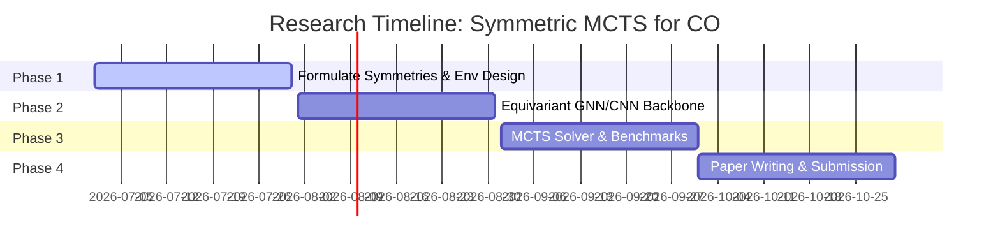

# Roadmap: Symmetric Monte Carlo Tree Search for Rotation-Invariant Combinatorial Optimization on Graphs

This document details the research roadmap for utilizing Group Equivariant Neural Networks and Monte Carlo Tree Search to solve symmetric Combinatorial Optimization (CO) problems.

---

## 1. Research Overview
Combinatorial optimization problems on grids or graphs (such as the Travelling Salesperson Problem (TSP), Vehicle Routing Problem (VRP), or chip floorplanning) exhibit physical and topological symmetries. Standard deep learning solvers require massive data augmentation to learn that rotated or reflected instances of the same problem have symmetric solutions. 

This research proposes a **G-Equivariant Policy-Value Network** mapped to a **Monte Carlo Tree Search (MCTS)** solver. By hardcoding symmetries (like the Dihedral group $D_4$ or permutation groups $S_n$) directly into the neural network architecture, we restrict the search space to symmetric functions, enabling zero-shot generalization to rotated, reflected, or isomorphic configurations.

---

## 2. Core Mathematical Formulations

### 2.1 Graph Isomorphism and Permutation Symmetries
Let $G = (V, E)$ be a graph with adjacency matrix $A \in \{0, 1\}^{n \times n}$. A permutation matrix $P \in S_n$ represents a node re-indexing. The graph structure is invariant under permutation if:
$$A' = P A P^T$$

The policy network $\pi_\theta(a | A)$ predicting the next node to visit must be equivariant under node permutation:
$$\pi_\theta(P \cdot a \mid P A P^T) = P \cdot \pi_\theta(a \mid A)$$

### 2.2 Equivariant PUCT Selection
During the MCTS phase, if the input graph is transformed by $g$, the search tree selection is mapped equivariantly:
$$a^* = \arg\max_{a} \left( Q(g \cdot s, g \cdot a) + c_{puct} \pi_\theta(g \cdot a \mid g \cdot s) \frac{\sqrt{\sum N(g \cdot s, g \cdot b)}}{1 + N(g \cdot s, g \cdot a)} \right)$$

---

## 3. Step-by-Step Research Roadmap

### Phase 1: Environment Selection & Group Definition (Weeks 1-4)
* **Goal:** Select the target CO problem (e.g., Grid-based VRP or TSP) and define the symmetry group (e.g., $D_4$ for grids, $S_n$ for graphs).
* **Deliverables:** A deterministic simulation environment mapping states to graph tensors and actions to valid routing steps.

### Phase 2: Equivariant Graph/Grid Backbone (Weeks 5-8)
* **Goal:** Build the Equivariant Neural Network backbone. If grid-based, use Equivariant Convolutions (`ConvG`). If graph-based, use Permutation-Equivariant GNNs.
* **Deliverables:** Unit tests verifying that rotating or permuting inputs yields rotated/permuted policy probabilities:
  $$\pi_\theta(g \cdot a \mid g \cdot s) == g \cdot \pi_\theta(a \mid s)$$

### Phase 3: MCTS Integration & Solver Benchmarking (Weeks 9-12)
* **Goal:** Embed the policy-value heads into an MCTS solver. Benchmark against classical solvers (e.g., Concorde for TSP, OR-Tools) and standard CNN+RL baselines.
* **Deliverables:** Zero-shot generalization tests proving that the model maintains 100% solution quality when instances are rotated or reflected, while standard baselines degrade.

### Phase 4: Formatting & Submission (Weeks 13-16)
* **Goal:** Compile results, plot training convergence rates, draft mathematical proofs for policy equivariance over graphs, and write the research paper.
* **Target Venue:** NeurIPS, ICLR, or IEEE Transactions on Cybernetics.

---

## 4. Key Challenges & Mitigation
* **Challenge:** Graph permutation groups $S_n$ are extremely large compared to $D_4$.
* **Mitigation:** Use Message Passing Neural Networks (MPNNs) that are naturally equivariant under node permutations, limiting the group operations to localized node neighborhoods.
